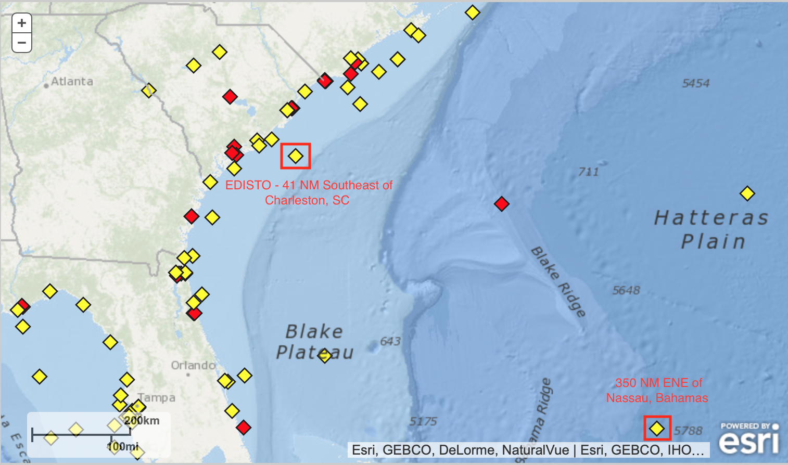

# Data Mining Project

## Links to Data (2019):
* [National Data Buoy Center](https://www.ndbc.noaa.gov)

## Official Data Sets for Folly Surf Forecasting:
* [ENE Nassau Offshore Data](https://www.ndbc.noaa.gov/station_history.php?station=41047)
* [Edisto Inshore Data](https://www.ndbc.noaa.gov/station_history.php?station=41004)

## Feature Descriptions:
* **WDIR:** Wind direction (the direction the wind is coming from in degrees clockwise from true N) during the same period used for WSPD. See Wind Averaging Methods

* **WSPD:** Wind speed (m/s) averaged over an eight-minute period for buoys and a two-minute period for land stations. Reported Hourly. See Wind Averaging Methods.

* **GST:** Peak 5 or 8 second gust speed (m/s) measured during the eight-minute or two-minute period. The 5 or 8 second period can be determined by payload, See the Sensor Reporting, Sampling, and Accuracy section.

* **WVHT:** Significant wave height (meters) is calculated as the average of the highest one-third of all of the wave heights during the 20-minute sampling period. See the Wave Measurements section.

* **DPD:** Dominant wave period (seconds) is the period with the maximum wave energy. See the Wave Measurements section.

* **APD:** Average wave period (seconds) of all waves during the 20-minute period. See the Wave Measurements section.

* **MWD:** The direction from which the waves at the dominant period (DPD) are coming. The units are degrees from true North, increasing clockwise, with North as 0 (zero) degrees and East as 90 degrees. See the Wave Measurements section.

* **PRES:** Sea level pressure (hPa). For C-MAN sites and Great Lakes buoys, the recorded pressure is reduced to sea level using the method described in NWS Technical Procedures Bulletin 291 (11/14/80). ( labeled BAR in Historical files)

* **ATMP:** Air temperature (Celsius). For sensor heights on buoys, see Hull Descriptions. For sensor heights at C-MAN stations, see C-MAN Sensor Locations

* **WTMP:** Sea surface temperature (Celsius). For buoys the depth is referenced to the hull's waterline. For fixed platforms it varies with tide, but is referenced to, or near Mean Lower Low Water (MLLW).

* **DEWP:** Dewpoint temperature taken at the same height as the air temperature measurement.

* **VIS:** Station visibility (nautical miles). Note that buoy stations are limited to reports from 0 to 1.6 nmi.

* **PTDY:** Pressure Tendency is the direction (plus or minus) and the amount of pressure change (hPa)for a three hour period ending at the time of observation. (not in Historical files)

* **TIDE:** The water level in feet above or below Mean Lower Low Water (MLLW).

## Problem Scope:

Hopefully from both the inshore and offshore folly buoy data, our team can find useful features for surf quality predictions. Examples could be how the offshore data correlates to the inshore data. This could be applied in giving alerts to surfers/ocean aficionados when a prediction for quality waves are made. Our team will hopefully be able to use other sites as well, for fact checking how well our model made predictions based on actual surf reports on the corresponding day at Folly. Sites include Surfline, Swellinfo, and Magic Seaweed, etc. 

## Plan of Attack:

Using prior domain knowledge, make assumptions for what features can be extracted to find the best wave quality predictions. For example, North West winds are offshore at Folly and make the waves a cleaner texture. Longer swell periods usually suggests that the waves are more organized and enable surfers to catch longer rides. Incoming tide usually means that the waves tend to be bigger with the tiding coming in. In the future, we are looking to implement a historical wave quality check from surf forecast sites such as Surfline, swellinfo, or magic seaweed. 

## Author:

[*Evan Tanner*](https://github.com/surfevant)

